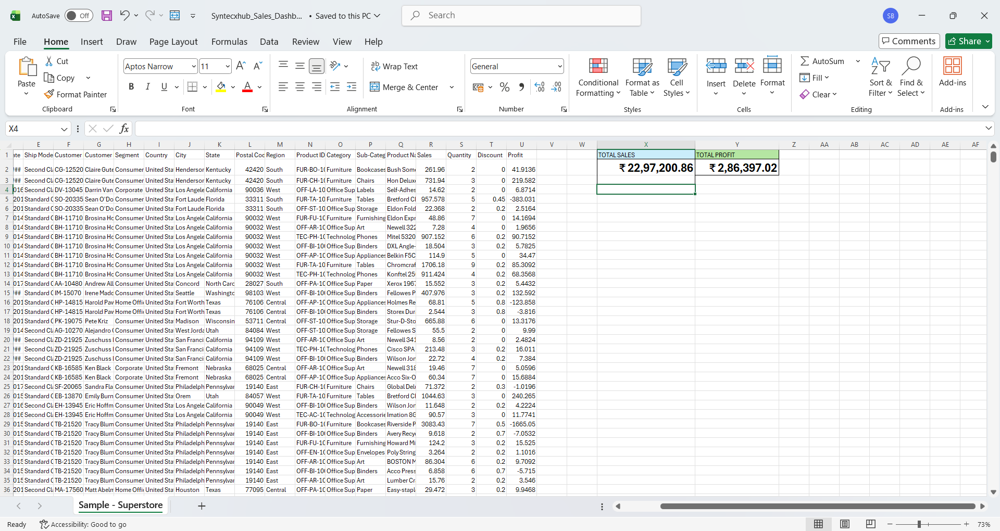

# Superstore KPI Dashboard

## Project Overview
Built an Excel dashboard from Sample Superstore dataset to track Sales and Profit KPIs and demonstrate data analysis skills.

## Key Metrics
| KPI | Value | Formula Used |
| --- | --- | --- |
| Total Sales | ₹22,97,201 | `=SUM(R:R)` |
| Total Profit | ₹2,86,397 | `=SUM(U:U)` |
| Profit Margin | 12.5% | `=Y2/X2` |

## Skills Demonstrated
- **Excel Functions:** SUM, basic arithmetic formulas
- **Data Formatting:** Currency format, Merge & Center, Borders, Fill Color
- **Dashboard Design:** KPI cards with color coding for visual impact
- **Problem Solving:** Debugged scientific notation display & formula errors

## Dashboard Preview

## How to Use
1. Download `Syntechub_Sales_Dashboard.xlsx`
2. KPIs auto-calculate from Sales (Column R) and Profit (Column U)
